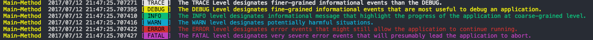

# Logsys
简单的对go/tool进行封装增加颜色的支持




### Code:
> 标准输出
 ```
    //初始化logger,获得一个新创建的logcat.Logger指针
    logger := logsys.Init(os.Stdout, "Main-Method", logsys.LStdOut, logsys.TRACE|locat.ERROR)

	logger.Trace("The TRACE Level designates finer-grained informational events than the DEBUG.")
	logger.Debug("The DEBUG Level designates fine-grained informational events that are most useful to debug an application.")
	logger.Info("The INFO level designates informational message that highlight the progress of the application at coarse-grained level.")
	logger.Warn("The WARN level designates potentially harmful situations.")
	logger.Error("The ERROR level designates error events that might still allow the application to continue running.")
	logger.Fatal("The FATAL level designates very severe error events that will presumably lead the application to abort.")
 ```


 > 输出到文件
 ```
    //创建日志文件
    file, err := os.Create("test.dat")
	if err != nil {
		fmt.Println(err.Error())
	}

    //初始化logger
	logger := logsys.Init(file, "Main-Method", logsys.LStdOut, logsys.TRACE|logcat.DEBUG)

	logger.Trace("The TRACE Level designates finer-grained informational events than the DEBUG.")
	logger.Debug("The DEBUG Level designates fine-grained informational events that are most useful to debug an application.")
	logger.Info("The INFO level designates informational message that highlight the progress of the application at coarse-grained level.")
	logger.Warn("The WARN level designates potentially harmful situations.")
	logger.Error("The ERROR level designates error events that might still allow the application to continue running.")
	logger.Fatal("The FATAL level designates very severe error events that will presumably lead the application to abort.")
 ```
